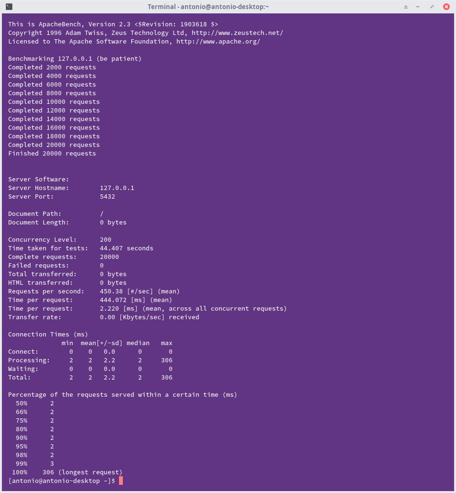
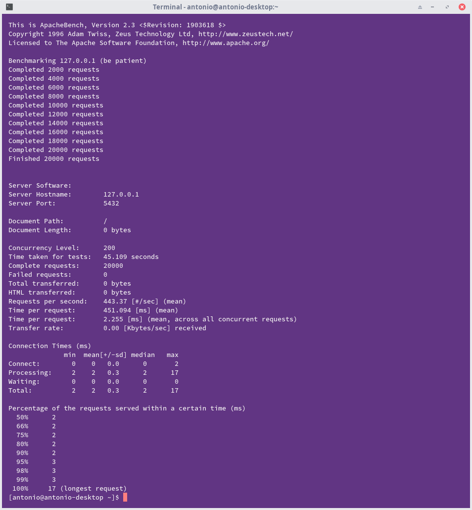

# Cache purge: read response time before and after cache is purged depending on share of frequently queried keys

## Personal data

Name: Antonio Jović
Course: Infrastructure for large-scale data
Year: First year of Masters Degree

## Intruduction to experimental work

In this benchmark, the goal was to see the difference between purged cache and non purged cache when we have Frequently Queried Keys.

Frequently Queried Keys are specific data elements or identifiers that are regularly and repeatedly requested or accessed within a system or application. In the context of caching and database systems, these keys represent data entries that are popular and frequently retrieved.

Basically, any frequently requested column.

For this purpose, I decided to go for PostgreSQL database, since it is a relational-model database and according to some sites, relational-model databases are good databases to test this.

## Problem

To achieve this, I will be using index over some column in table. There will be changes though, where I will be monitoring with cache purge and without it but when there is no index and also when there is one some of them.

Cache is usually meant to speed up the process of querying data, because some of data is stored locally and it doesn't need to be queried all the time. It is really important when we have a lot of data so that data can be retrieved faster.

Purging cache in all cases will slow down primarily due to increased disk I/O and the need to rebuild caches, which can have temporary performance implications.

In most of the cases, it is not recommended to purge cache, however there are some scenarios where it can have some uses like:

- data refresh
- possible corruption problems

## Docker compose architecture

In Docker Compose file I defined a simple setup for running a PostgreSQL database and a pgAdmin web interface, allowing me to manage the PostgreSQL database easily. The services are connected through the defined volumes, ensuring data persistence even if the containers are stopped or removed.

```yaml
version: "3.8"
services:
  postgres:
    image: postgres
    container_name: local_pgdb
    restart: always
    ports:
      - "5432:5432"
    environment:
      POSTGRES_USER: pgsqladmin
      POSTGRES_PASSWORD: pgsqladminpass
    volumes:
      - local_pgdata:/var/lib/postgresql/data
  pgadmin:
    image: dpage/pgadmin4
    container_name: pgadmin4_container
    restart: always
    ports:
      - "8888:80"
    environment:
      PGADMIN_DEFAULT_EMAIL: pgadmin@pgadmin.com
      PGADMIN_DEFAULT_PASSWORD: pgadminpass
    volumes:
      - pgadmin-data:/var/lib/pgadmin
    tty: true
    depends_on:
      - postgres

volumes:
  local_pgdata:
  pgadmin-data:
```

When Docker "composes" those container, PostgreSQL database will be exposed on [localhost:5432](http://localhost:5432) and pgAdmin database will be exposed on [localhost:8888](http://localhost:8888). Do note that there will be some delay when you open the pgAdmin website because it's not fully up yet, but it should be up after around one minute.

## Data simulation

To simulate data, since we have pgAdmin, which serves as admin page for PostgreSQL (it's their official tool), we can create tables, drop them etc inside the tool. Also there is a possibility of creating insertion of data in tool, but it would be really ineffective since we can't make made up data on hands.

To fake data, I used Faker module for Python. I also needed psycopg2-binary module, which allows connection and execution of qeuries in Python on PostgreSQL database.

Here is an example of creating table with name Users:

`db_scripts.py:`

```py
import psycopg2
from psycopg2 import sql

dbname = "postgres"
user = "pgsqladmin"
password = "pgsqladminpass"
host = "127.0.0.0"
port = "5432"

conn = psycopg2.connect(dbname=dbname, user=user, 
        password=password, host=host, port=port)

cursor = conn.cursor()

table_name = "Users"

create_users_table = sql.SQL("""
    create table if not exists{}(
        UserID SERIAL PRIMARY KEY,
        Name VARCHAR(40),
        Surname VARCHAR(40),
        PhoneNumber VARCHAR(13),
        DateOfBirth DATE,
        Gender VARCHAR(6)
    )""").format(sql.Identifier(table_name))


cursor.execute(create_users_table)
conn.commit()
```

**Note:** data for connection is the same data needed when You login into pgAdmin website.

Also, here is an example of faking data:

`fake_data.py:`

```py
import faker
...
def generate_fake_user():
    fake = Faker()
    fake_user = {
        'name': fake.first_name(),
        'surname': fake.last_name(),
        'phone': fake.msisdn(),
        'date_of_birth': fake.date_of_birth(),
        'gender': fake.random_element(elements=('Male', 'Female')),
    }
    return fake_user
...
def insert_fake_data(conn):
...
    for _ in range(10000):
        fake_user = generate_fake_user()
        cursor.execute("""
            INSERT INTO \"Users\" (Name, Surname, PhoneNumber, DateOfBirth, Gender)
            VALUES (%s, %s, %s, %s, %s);
        """, (
            fake_user['name'],
            fake_user['surname'],
            fake_user['phone'],
            fake_user['date_of_birth'],
            fake_user['gender']
        ))

    conn.commit()
```

## Reading response time

To read response time, I used Apache AB benchmarking tool which allows load simulation of multiple users at the same time.

To do this, I used command:

```bash
ab -n 20000 -c 200 http://127.0.0.1:5432/
```

Those numbers in some cases where changed to see more differences rather than just one case.

### No index, after some caching

After some benchmarking and of course some caching, I got next results:


We can see that time for tests for a little less then 50 seconds. Also Amount of requests per second was around 402 and time per request in miliseconds was around 496. Longest request was around 16 miliseconds.

### No index, after full purge


We can now see that time for tests was around 45 seconds which is wierd, but amount of requests went up to 438 and time per request in miliseconds was around 456. Longest request was around 1 second, which is significant increase. Also standard deviation went up to 7,5.

### No index, after only dropping caches



We can now see that time for tests was around 44 seconds which will be mostly the same even in next tests, but amount of requests went up to 450 and time per request in miliseconds was around 445. Longest request was around 300 miliseconds, which means that there was some change but not as significant as before. Standard deviation was now back to normal.

After adding indexes, there were some changes and rather wierd ones.

### With index, after full purge


We can now see that time for tests was around 46 seconds so no change, but amount of requests went down to 431 and time per request in miliseconds went up to around 463. Longest request was around 2 seconds, which is a lot compared to non indexed value. Also standard deviationt went up to 14, which is almost as twice as much when it was without index.

### With index, after purge without drop caches



We can now see that time for tests was around 45 seconds so almost no change, but amount of requests went up now to 443 and time per request in miliseconds went down to around 451. Longest request was around 17 miliseconds, so that means that now those two purges didn't have as much of significance to cache. Also standard deviationt was almost equal to zero.

### No index, after purge without drop caches during benchmarking


Unline previous picture, longest request was around 600 miliseconds, which is a significant difference.

There are more pictures in images folder, but i went for those that were the most interesting.
